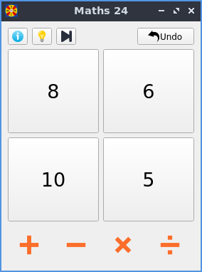
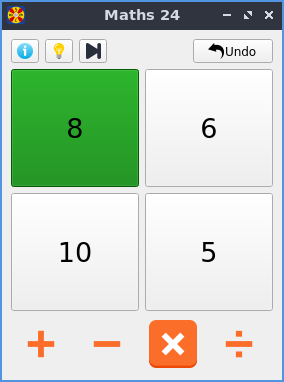
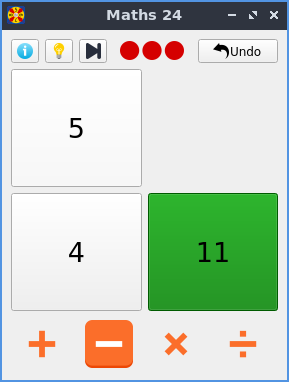
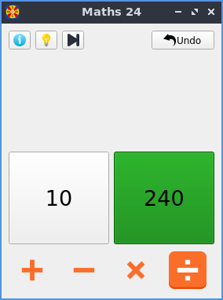
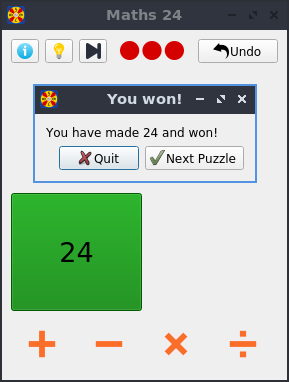

# Maths24-Qt

A free and open-source implementation of Maths 24 (24 game).

## Install

### Linux

Get the deb file from the [releases page](https://github.com/IgniparousTempest/maths24-qt/releases).

    sudo apt install ./python3-maths24-qt_0.9.9-1_all.deb

### Windows

It is written in python, so it should work on Windows. I haven't tried it yet, but if you follow the generic instruction below and substitute the make command with the contents of the Makefile, you will come right.

### Generic

    git clone https://github.com/IgniparousTempest/maths24-qt
    cd maths-24
    make init
    source venv/bin/activate
    python main.py 

## Screenshots

